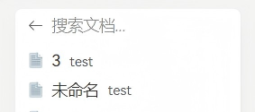
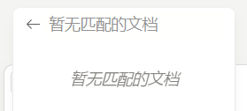
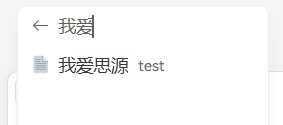
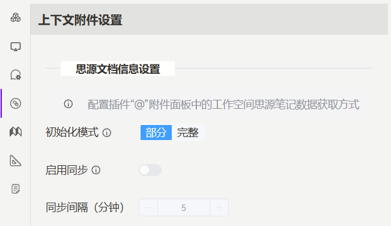

    

[1.x changelog](https://github.com/Asianfleet/siyuan-plugin-aether/blob/main/CHANGELOG.md)

## v2.5.0

- Reconstructed "Workspace" option in attachment panel:
  - Added **two loading modes**: Partial and Full. In Full mode, the plugin will query all SiYuan notes during initialization, and the "Workspace" panel will hold data for all SiYuan notes (left in the figure below). In Partial mode, the plugin will only get documents from opened tabs and recently opened documents during initialization. The "Workspace" panel will not display all SiYuan documents, but users can dynamically search through the search box (right in the figure below).
  
  

    
    
    
  

  
  - In Full mode, **sync settings** are available: the plugin will periodically re-fetch SiYuan note information at set intervals (in minutes) to update user modifications during this period.
- Added "Context Settings" for configuring the above modes
  

    
  

- Added "Recently opened files" option to attachment panel, and added return button to each sub-panel
- Optimized plugin configuration loading logic

## v2.4.0

- Added **link context type**:
  - The link content pasted into the input box will be automatically parsed as context attachment (note: not supported for Siyuan block hyperlink, if the pasted content contains a link, it must be surrounded by spaces, otherwise it will be treated as normal text)
  - Added "Add to Aether input" option in hyperlink right-click menu, can directly add the selected hyperlink to the input box
- Added "Add to Aether input" option in image menu and breadcrumb more menu
- Optimized internal data loading logic

## v2.3.1

- Optimized internal configuration loading logic
- Fixed compatibility issues with toolkit-plugin-siyuan plugin (when used together, it will cause Aether to fail to read plugin configurations)

## v2.3.0

- Ensure API key **uses ISO-8859-1 encoding** and performs URL encoding processing: when calling the online model interface, the API key is encoded for compatibility processing
  - Response to error 1: [Aether] Failed to start stream:Failed to execute 'append' on 'Headers': String contains non ISO-8859-1 code point. v3.3.6 
  - Response to error 2: Failed to get model list: Failed to construct 'Headers': String contains non ISO-8859-1 code point
- **Added block content deduplication function** to solve the problem of duplicate content: when the selected block contains a title, the "Add to Aether input" option will cause duplicate content
- Fixed the **behavior anomaly** problem of the plugin sidebar icon after dragging: when the plugin is in the conversation state, dragging the sidebar icon will cause the plugin operation to fail
- Plugin style optimization: updated the CSS class names of several components, unified the naming space, and enhanced the style isolation

## v2.2.1

- Improved model context usage rate component: when the current model does not set the context window, the component is not displayed
- Improved plugin configuration loading logic
- Optimized user message toolbar style

## v2.2.0

- **The tags of conversation records will be automatically generated**
- Fixed the problem that the plugin icon can only open the standalone window normally when it is in the upper right corner
- Fixed the 1.x version link in the changelog interface
- Plugin style optimization

## v2.1.2

- Fixed the problem that the plugin icon can only open the standalone window normally when it is in the upper right corner
- Fixed the 1.x version link in the changelog interface
- Plugin style optimization

## v2.1.1

- Added **reasoning content folding feature**: when enabled, reasoning content will be automatically folded after thinking is completed, and clicking to expand will display the full content
- Optimized input box style

## v2.1.0

- Added **message history export function**
- Added **user message folding feature**: when enabled, user input messages that are too long will be automatically folded, only displaying partial content, and clicking to expand will display the full content
- When dragging a Siyuan tab to the input box, if the notebook is in focus, **only the focused part will be extracted as context**

## v2.0.1

- **Support top_p parameter**
- Fixed compatibility issues with kmind plugin

## v2.0.0

**Refactor plugin code**

- UI style optimization
- Added rules and command features
- Input box
  - Added display of current conversation context consumption
  - Added clipboard for temporary text storage
- Conversation interface
  - Removed old message cards
  - Added conversation directory for quick navigation to specific conversations
  - Added "Back to top" button for quick return to conversation top (also can be used to return to bottom)
  - Added HTML code block preview
  - Added message content selection toolbar for selecting, copying, quoting, and asking about message content
  - Support for moving messages to background generation
- Conversation history
  - Added conversation pinning, renaming, and tagging features
  - Added conversation search function with tag filtering support
  - Background messages support generation termination
- Standalone window mode
  - Major interface layout adjustment
  - Message history directly located on the left side of interface, draggable to adjust width, hide/expand
  - Responsive layout supporting narrow and wide screens

