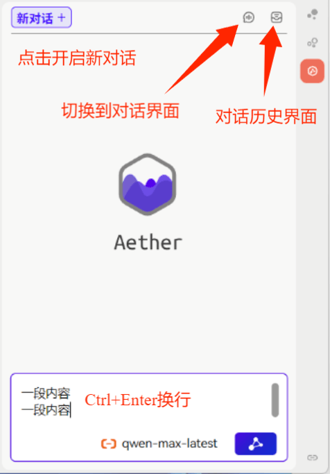

<!-- markdownlint-disable MD033 -->
<!-- markdownlint-disable MD041 -->
<!-- markdownlint-disable MD036 -->

    

# Aether （以太）

Aether —— Where Dialogue Meets Depth.

## 简介

Aether 是一个为思源笔记软件设计的插件。该插件在侧边栏添加了一个按钮，点击后可以弹出一个侧边视图，能够与大型语言模型进行对话（后续将会继续增加与思源深度结合的功能）。
⚠️ **注意：** 由于个人时间关系，当前仅是**极为早期**的版本。在版本稳定之前会有重大变动，请及时将对话信息保存到其他地方。

## 开始

    
    
点击这个按钮即可打开对话界面

## 功能介绍

### 界面

- **模型选择与配置**
    1. 点击右下角的模型选择按钮
        

            
            
点击这个按钮即可打开对话界面

        

    2. 在此处可以选择对应的模型服务提供方并填入对应的 API Key ，随后点击保存按钮，即可保存 API Key 到内部配置中，并且之后的对话将会使用面板中选择的模型。若要切换模型，则需再打开面板，选中另外的模型并点击保存按钮。（目前仅支持阿里云、DeepSeek、OpenAI、Siliconflow 以及 Agicto 提供方，后续会支持更多的服务提供方以及自定义提供方）
    

        
        
点击保存按钮即可保存当前信息

    

- **对话界面**
    

        
        
功能如图所示

    

- **对话历史界面**
    

        
        
功能如图所示

    

### 对话

    
    
    
功能如图所示

_注：Token 以及 API Cost 的计算结果仅供粗略估计，并不完全准确。后续会更新自动余额查询功能_
