<!-- markdownlint-disable MD033 -->
<!-- markdownlint-disable MD041 -->
<!-- markdownlint-disable MD036 -->

    

[中文 README](README.md) | [CHANGELOG](CHANGELOG.md)

# Aether

Aether —— Where Dialogue Meets Depth.

## Introduction

Aether is a plugin designed for Siyuan notes software. The plugin adds a button to the sidebar that, when clicked, opens a side panel for dialogue with large language models (more features integrated with Siyuan will be added later).
⚠️ **Note:** Due to personal time constraints, this is currently a **very early** version.
⚠️ **Note:** Personal configurations and conversation records will be cleared until the version stabilizes. Please save the conversation information elsewhere in a timely manner.

## Recently updated functions

- Picture and document input
- Modification and regeneration of message content in session

## Getting Started

    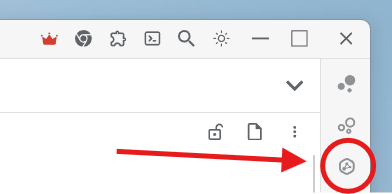
    
Click this button to open the dialogue interface

## Feature Introduction

### Interface

- **Model Selection and Configuration**
    1. Click the model selection button in the lower right corner
        

            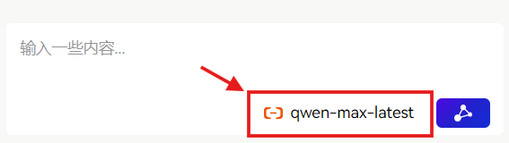
            
Click this button to open the dialogue interface

        

    2. Here you can choose the corresponding model service provider and enter the corresponding API Key, then click the save button to save the API Key to internal configuration, and subsequent dialogues will use the selected model in the panel. To switch models, you need to open the panel again, select another model, and click the save button. (Currently only supports providers such as Alibaba Cloud, DeepSeek, OpenAI, Siliconflow, and Agicto, and will support more service providers and custom providers later.)
        

            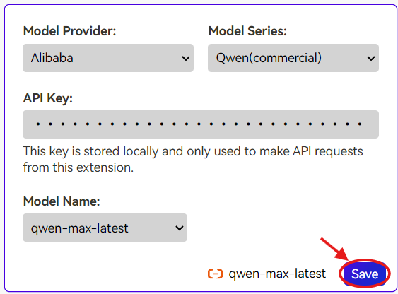
            
Click the save button to save the current information

        

    3. Custom model configuration
        

            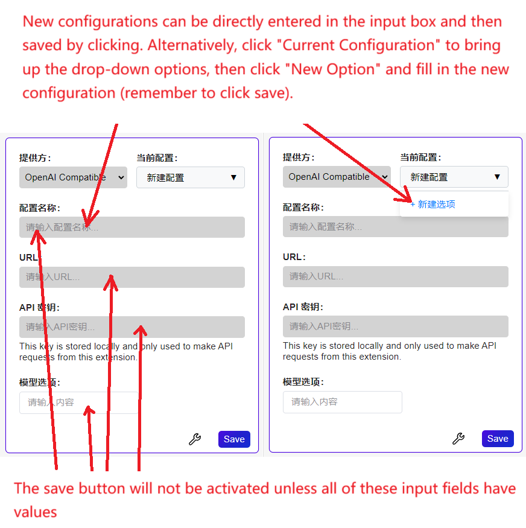
            
Custom model configuration interface

            
Note that if Siyuan does not refresh itself after updating the plug-in, please refresh it manually.

        

    4. Animated demonstration
        

            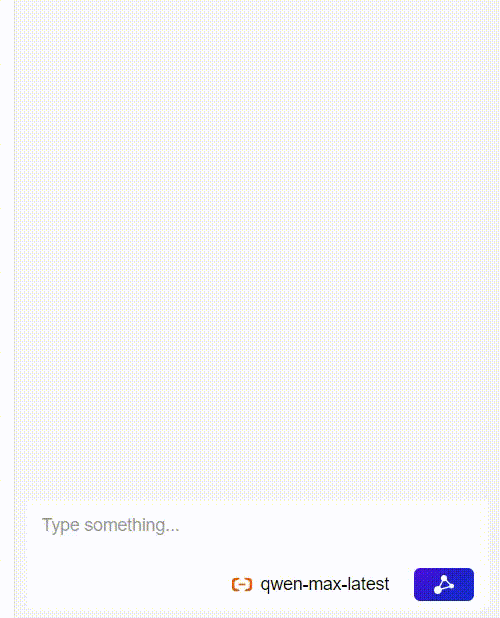
            
Model selection and configuration

        

- **Dialogue Interface**
    

        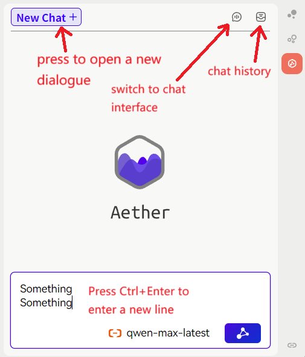
        
Functions are as shown in the figure

    

- **Dialogue History Interface**
    

        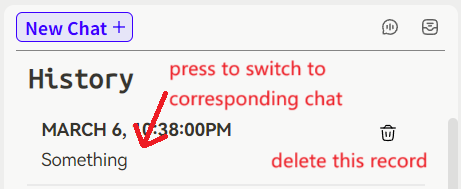
        
Functions are as shown in the figure

    

### Dialogue

    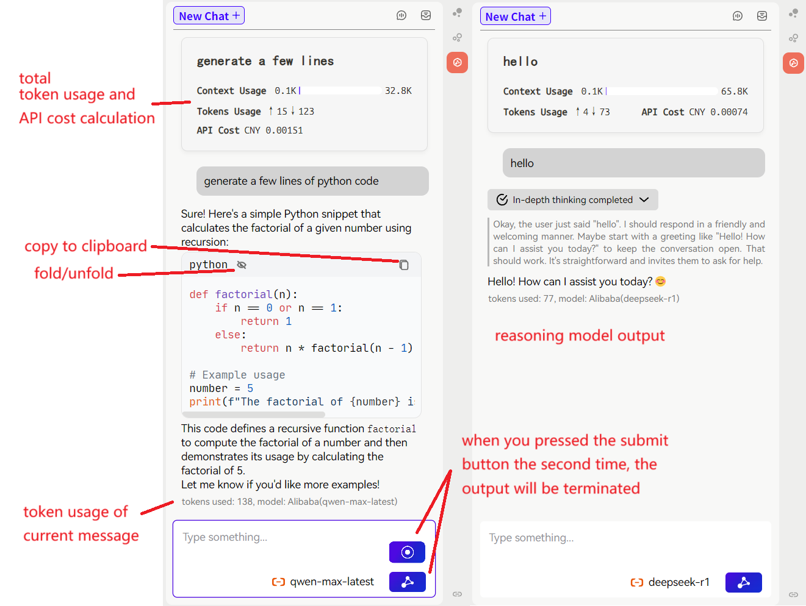

Basic interface

    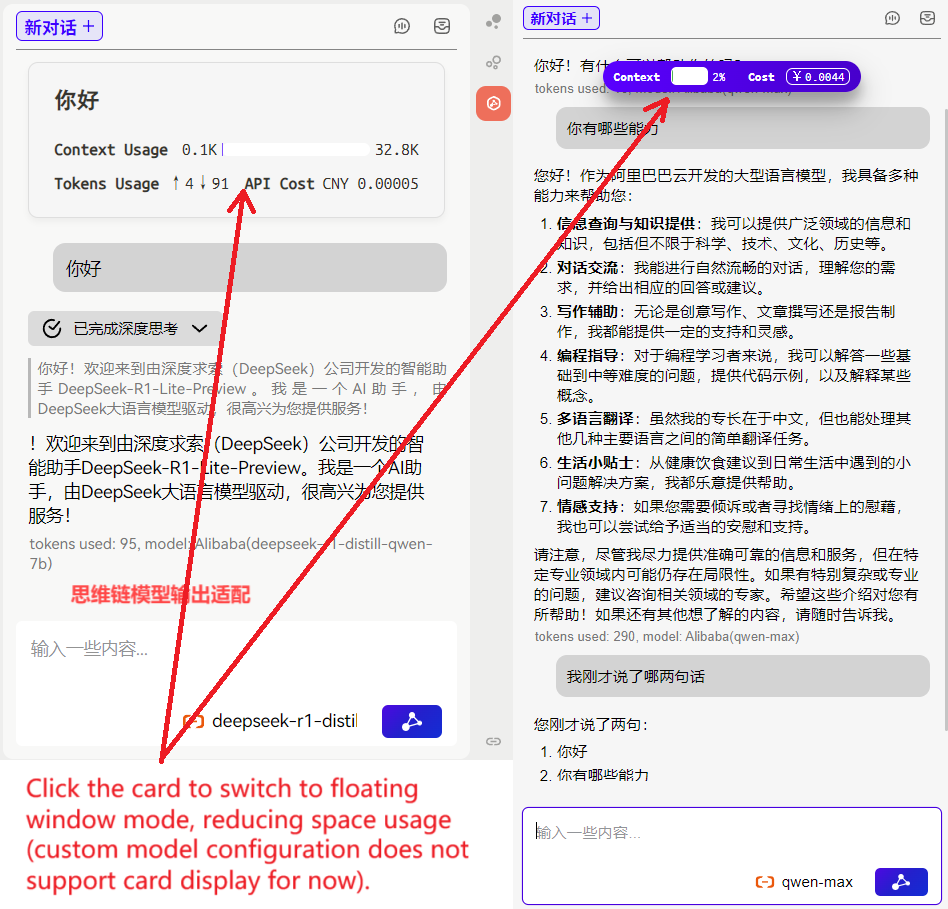

Message status display

    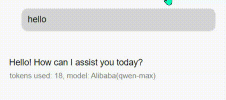

Message toolbar

    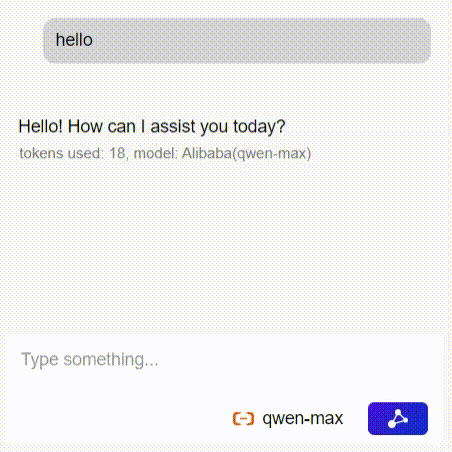

More options

    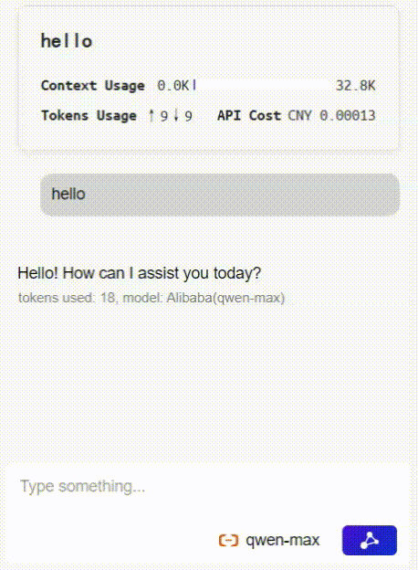

Copy message

    

Edit and resend

_Note: The calculation results of Tokens and API Costs are for rough estimates only and are not entirely accurate. An automatic balance query function will be updated later._
