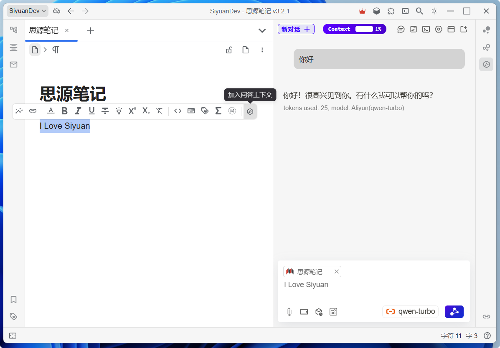
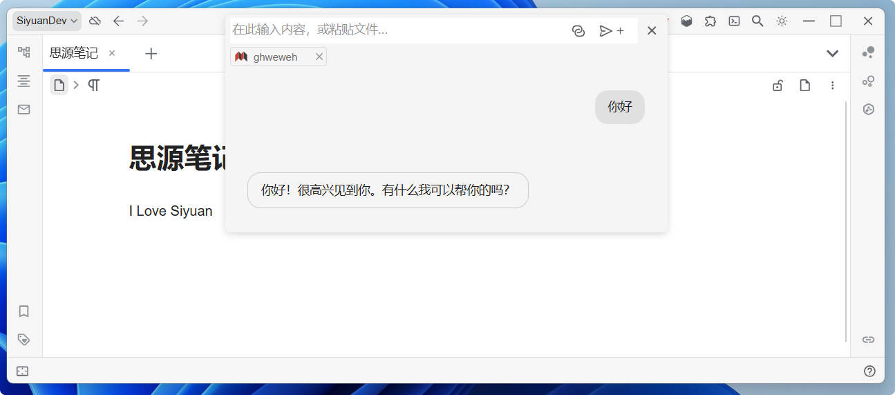
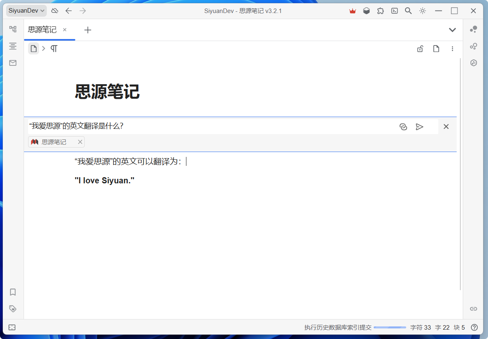
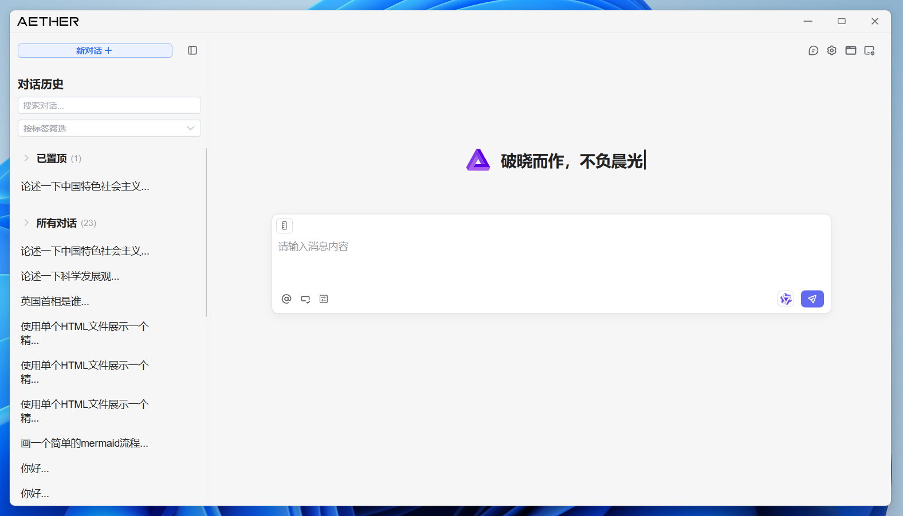
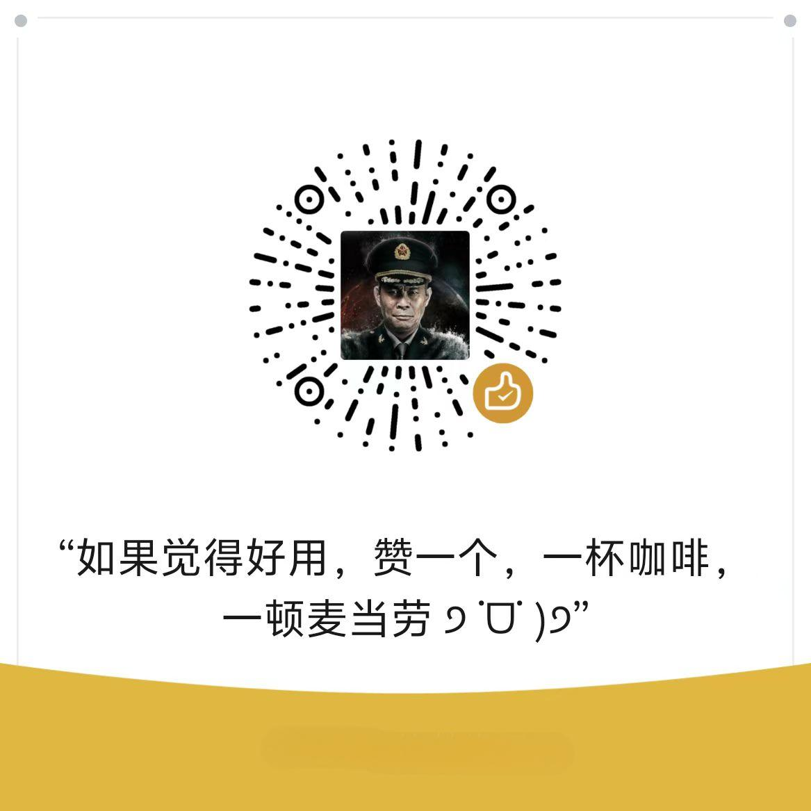

<!-- markdownlint-disable MD033 -->
<!-- markdownlint-disable MD041 -->
<!-- markdownlint-disable MD036 -->

    

[English README](README_en_US.md) | [更新记录](CHANGELOG.md) | QQ 交流群：1044315407（密码：Aether）

# Aether （以太）

Aether —— Where Dialogue Meets Depth.

## 简介

Aether is an LLM-based enhancement plugin designed for SiYuan Note, which supports sidebar conversations, standalone window conversations, and can also directly output content generated by the LLM within SiYuan files (features that deeply integrate with SiYuan will continue to be added).
⚠️ **Note:** Due to personal time constraints, the plugin is not yet fully stable. Before it becomes stable, it may clear personal settings and chat logs, so please save your important information elsewhere in a timely manner.

## Recently Implemented Features

- Added SiYuan Note files to context
- Style optimization
- Image and document input
- Modification and regeneration of message content in conversations
- Custom preset prompts
- Conversation history

## Getting Started

    
    
Right button: sidebar conversation; upper button: other conversation methods

## Core Interface

    
    
Sidebar interface

    
    
Instant conversation interface

    
    
Inline conversation interface

    
    
Standalone window interface (currently only supported on desktop version)

## Usage Documentation

[Click here to view the usage documentation](https://gcnicgs9mvik.feishu.cn/docx/STledhU8MohvqJxW3Z9cmEv1noe?from=from_copylink)

## Appreciate the Author

    

If you like this plugin, you can appreciate the author by donating one or more times. :D

